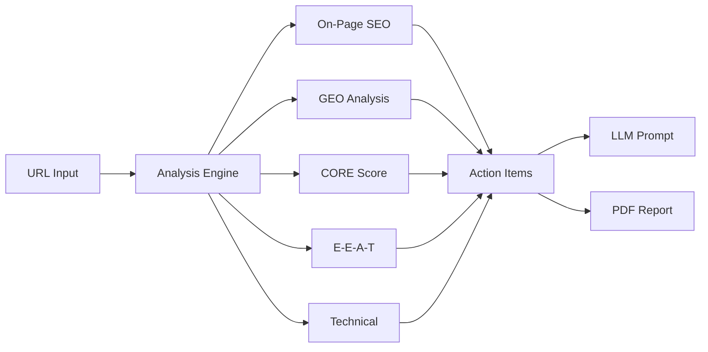

# SEO Analyzer Pro

> Comprehensive SEO & GEO (Generative Engine Optimization) analysis tool for modern web presence optimization.

[](https://opensource.org/licenses/MIT)
[](https://github.com/legacyai/seo-analyzer-pro)

## Overview

SEO Analyzer Pro is a powerful web application that analyzes websites for both traditional search engine optimization (SEO) and emerging Generative Engine Optimization (GEO). As AI systems like ChatGPT, Claude, Perplexity, and Google AI Overviews increasingly influence how users discover information, optimizing for AI citation has become essential.



## Features

### 🔍 Comprehensive Analysis
- **On-Page SEO**: Title tags, meta descriptions, heading hierarchy, image optimization, Open Graph tags
- **GEO Optimization**: AI-citation readiness, FAQ schema, structured data, quotable content
- **CORE Framework**: Contextual Clarity, Organization, Referenceability, Exclusivity
- **E-E-A-T Assessment**: Experience, Expertise, Authoritativeness, Trust signals
- **Technical SEO**: Mobile responsiveness, indexing, HTML standards

### 🤖 AI-Powered Implementation
- **Copy-Ready LLM Prompts**: Generate detailed prompts for ChatGPT, Claude, or other LLMs
- **Prioritized Action Items**: Critical, high, medium, and low priority fixes
- **Step-by-Step Instructions**: Detailed implementation guidance for each issue

### 📊 Scoring System
- **Overall Score**: Weighted composite of all analysis dimensions
- **Dimension Scores**: Individual scores for each analysis category
- **Visual Indicators**: Color-coded results for quick assessment

### 📄 Export Options
- **PDF Reports**: Professional analysis reports with all findings
- **Clipboard Export**: Copy LLM prompts for immediate implementation

## Quick Start

### Option 1: Direct Browser Usage

1. Open `seo-analyzer.html` in any modern browser
2. Enter a URL to analyze
3. Click "Analyze" to get results
4. Review scores and action items
5. Copy the LLM prompt to implement fixes

### Option 2: Local Server

```bash
# Using Python
python -m http.server 8000

# Using Node.js
npx serve .

# Using PHP
php -S localhost:8000
```

Then open `http://localhost:8000/seo-analyzer.html`

### Option 3: Deploy to Web

Deploy to any static hosting service:
- **Vercel**: `vercel deploy`
- **Netlify**: Drag and drop the folder
- **GitHub Pages**: Enable in repository settings


### Option 4: Monorepo Web App (Full Enterprise UI)

Requires Node.js ≥ 20.0.0 and pnpm 8.15.0.

```bash
# Install all workspace dependencies
pnpm install

# Start the Next.js web app dev server
pnpm --filter @seo-analyzer/web dev
```

Then open `http://localhost:3000`.

To start the full stack (web app + Fastify API) in parallel:

```bash
pnpm dev
```

## Tech Stack

| Component | Technology |
|-----------|------------|
| Web App | Next.js 14.2.3, TypeScript 5.3 |
| Styling | Tailwind CSS 3.4, Radix UI, ShadCN components |
| PDF Export | jsPDF 2.5 |
| Backend API | Fastify 5.2, TypeScript 5.7 |
| Database | PostgreSQL via Prisma 6.4 |
| Queue / Cache | Redis, BullMQ 5 |
| Package Manager | pnpm 8.15 (monorepo workspaces) |
| Standalone | `seo-analyzer.html` — zero-dependency single-file version |
## Analysis Framework

### CORE Scoring System

The CORE framework evaluates content for AI citation potential:

| Dimension | Description | Weight |
|-----------|-------------|--------|
| **C**ontextual Clarity | Does content clearly answer user intent? | 25% |
| **O**rganization | Is content structured for humans and machines? | 25% |
| **R**eferenceability | Can AI verify and cite the claims? | 25% |
| **E**xclusivity | Does content offer unique value? | 25% |

### E-E-A-T Assessment

Google's quality guidelines for content evaluation:

| Dimension | Description | Indicators |
|-----------|-------------|------------|
| **E**xperience | Real-world experience demonstrated | Author byline, personal insights |
| **E**xpertise | Professional knowledge shown | Credentials, depth of content |
| **A**uthoritativeness | Recognition in the field | External links, mentions |
| **T**rust | Safety and reliability | Contact info, privacy policy |

### GEO Priority Items

Optimized for AI engine citations:

1. **C02 (Direct Answer)**: Core answer in first 150 words
2. **C09 (FAQ Coverage)**: Structured FAQ with Schema
3. **O03 (Data Tables)**: Comparisons in tables, not prose
4. **O05 (Schema Markup)**: Appropriate JSON-LD
5. **E01 (Original Data)**: First-party data AI can cite
6. **O02 (Summary Box)**: Key Takeaways section

## Project Structure

```
seo-analyzer-pro/
├── apps/
│   ├── web/                   # Next.js 14 enterprise web app
│   │   ├── app/               # App Router pages and API routes
│   │   ├── components/        # UI components (ShadCN, theme)
│   │   └── package.json       # @seo-analyzer/web
│   └── api/                   # Fastify 5 REST API
│       ├── src/
│       │   ├── routes/        # auth, sites, scans, billing, ...
│       │   ├── workers/       # BullMQ scan worker
│       │   ├── services/      # scan, stripe, email services
│       │   └── prisma/        # schema.prisma (PostgreSQL)
│       └── package.json       # @seo-analyzer/api
├── packages/
│   ├── analyzer-core/         # Core SEO/GEO analysis engine
│   │   └── src/
│   │       ├── analyzers/     # onpage, geo, core, eeat, technical
│   │       ├── scorers/       # weighted score calculator
│   │       └── generators/    # action items, LLM prompts
│   ├── types/                 # Shared TypeScript types
│   └── ui/                    # Shared React UI primitives
├── seo-analyzer.html          # Standalone zero-dependency analyzer
├── docs/
│   ├── README.md              # This file
│   ├── USER_GUIDE.md          # Complete user documentation
│   ├── API_REFERENCE.md       # API documentation
│   ├── DEPLOYMENT.md          # Deployment guide
│   ├── WHITE_LABEL.md         # White-label setup
│   └── CHANGELOG.md           # Version history
├── package.json               # Monorepo root (pnpm workspaces)
└── pnpm-workspace.yaml        # Workspace configuration
```

## Browser Support

| Browser | Version | Support |
|---------|---------|---------|
| Chrome | 80+ | ✅ Full |
| Firefox | 75+ | ✅ Full |
| Safari | 13+ | ✅ Full |
| Edge | 80+ | ✅ Full |
| IE | Any | ❌ Not Supported |

## Contributing

We welcome contributions! Please see our contributing guidelines:

1. Fork the repository
2. Create a feature branch (`git checkout -b feature/amazing-feature`)
3. Commit changes (`git commit -m 'feat: add amazing feature'`)
4. Push to branch (`git push origin feature/amazing-feature`)
5. Open a Pull Request

## License

MIT License with Attribution Requirement

```
Copyright (c) 2026 Legacy AI / Floyd's Labs

Permission is hereby granted, free of charge, to any person obtaining a copy
of this software and associated documentation files (the "Software"), to deal
in the Software without restriction, including without limitation the rights
to use, copy, modify, merge, publish, distribute, sublicense, and/or sell
copies of the Software, and to permit persons to whom the Software is
furnished to do so, subject to the following conditions:

The above copyright notice and this permission notice shall be included in all
copies or substantial portions of the Software.

Attribution: Any use of this software must include visible attribution to
"Legacy AI / Floyd's Labs" with links to www.LegacyAI.space and www.FloydsLabs.com
```

## Support

- **Documentation**: [docs/](./docs/)
- **Issues**: [GitHub Issues](https://github.com/legacyai/seo-analyzer-pro/issues)
- **Email**: support@legacyai.space

## Acknowledgments

Built with ❤️ by the Legacy AI / Floyd's Labs team.

Special thanks to the SEO and AI communities for advancing the field of Generative Engine Optimization.

---

<div align="center">

**[Legacy AI](https://www.legacyai.space) | [Floyd's Labs](https://www.floydslabs.com)**

Copyright (c) 2026 Legacy AI / Floyd's Labs

</div>
