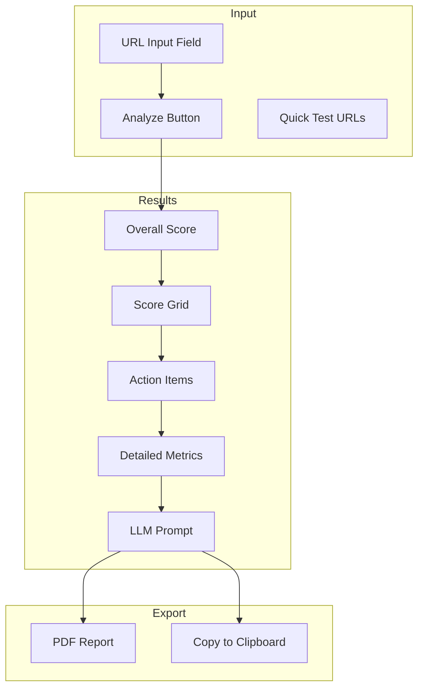
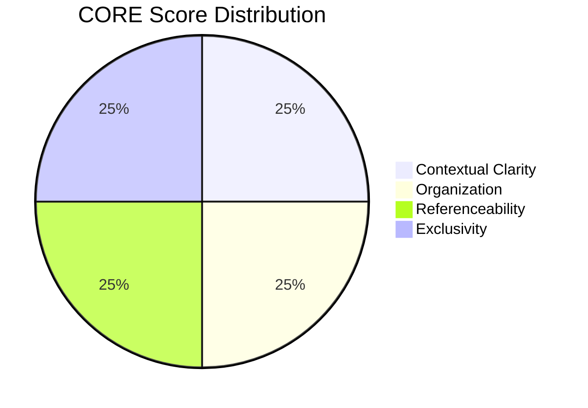
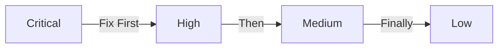
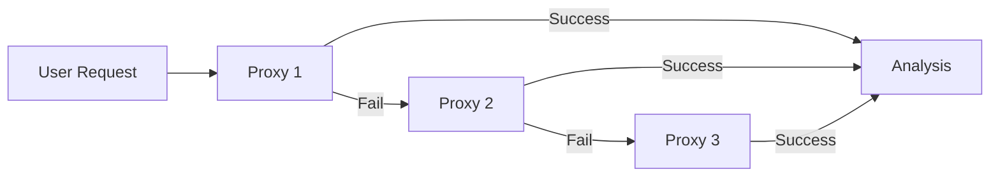
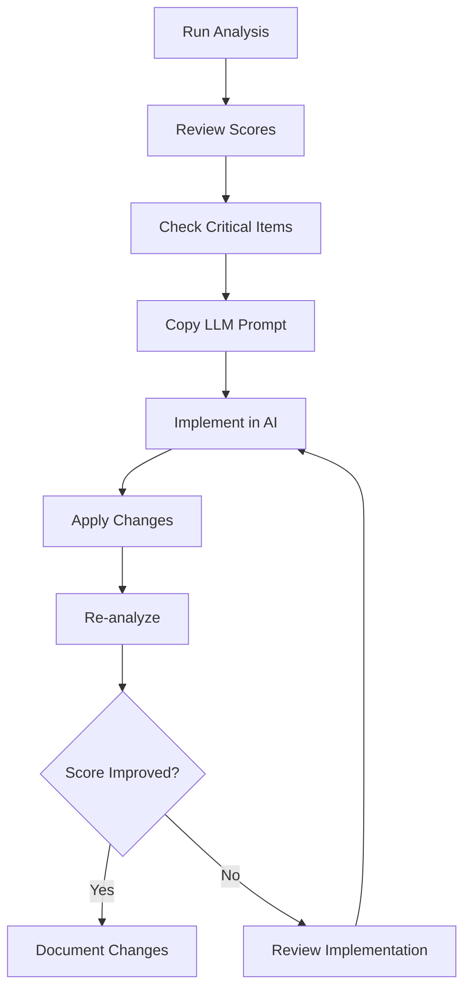

# SEO Analyzer Pro - User Guide

> Complete guide to using SEO Analyzer Pro for website optimization

---

## Table of Contents

1. [Getting Started](#getting-started)
2. [Interface Overview](#interface-overview)
3. [Running Your First Analysis](#running-your-first-analysis)
4. [Understanding Scores](#understanding-scores)
5. [Working with Action Items](#working-with-action-items)
6. [Using LLM Prompts](#using-llm-prompts)
7. [Exporting Reports](#exporting-reports)
8. [Advanced Features](#advanced-features)
9. [Troubleshooting](#troubleshooting)

---

## Getting Started

### System Requirements

- Modern web browser (Chrome 80+, Firefox 75+, Safari 13+, Edge 80+)
- Internet connection for fetching website content
- JavaScript enabled

### Accessing the Tool

**Option 1: Direct File Access**
```
Open seo-analyzer.html directly in your browser
```

**Option 2: Local Server**
```bash
# Python
python -m http.server 8000

# Node.js
npx serve .

# Navigate to http://localhost:8000/seo-analyzer.html
```

**Option 3: Hosted Version**
```
Deploy to Vercel, Netlify, or any static hosting service
```


**Option 4: Monorepo Web App (Full Enterprise UI)**

Requires Node.js ≥ 20.0.0 and pnpm 8.15.0.

```bash
# Install all workspace dependencies
pnpm install

# Start the Next.js web app
pnpm --filter @seo-analyzer/web dev
```

Then open `http://localhost:3000`.

To start the full stack (web app + Fastify API) simultaneously:

```bash
pnpm dev
```

---

## Interface Overview



### Main Components

| Component | Description |
|-----------|-------------|
| **URL Input** | Enter the website URL to analyze |
| **Analyze Button** | Start the analysis process |
| **Quick Test URLs** | Pre-configured test URLs for demonstration |
| **Overall Score** | Composite score across all dimensions |
| **Score Grid** | Individual dimension scores |
| **Action Items** | Prioritized list of improvements |
| **Detailed Metrics** | Category-specific analysis results |
| **LLM Prompt** | Copy-ready prompt for AI implementation |

---

## Running Your First Analysis

### Step 1: Enter URL

1. Locate the URL input field at the top of the page
2. Enter the full URL including `https://`
3. Example: `https://www.example.com`

### Step 2: Start Analysis

1. Click the **Analyze** button
2. Watch the loading indicator
3. Analysis typically completes in 5-15 seconds

### Step 3: Review Results

The results page displays:

```
┌─────────────────────────────────────────┐
│  Overall SEO & GEO Score         [85]   │
│  https://www.example.com                │
├─────────────────────────────────────────┤
│  CORE: 78/100  │  E-E-A-T: 82/100       │
│  GEO: 75/100   │  Technical: 90/100     │
└─────────────────────────────────────────┘
```

---

## Understanding Scores

### Score Ranges

| Range | Rating | Color | Action |
|-------|--------|-------|--------|
| 90-100 | Excellent | 🟢 Green | Maintain current optimization |
| 75-89 | Good | 🔵 Blue | Minor improvements possible |
| 60-74 | Fair | 🟡 Yellow | Several improvements needed |
| 40-59 | Poor | 🟠 Orange | Significant work required |
| 0-39 | Critical | 🔴 Red | Major issues present |

### Score Dimensions

#### On-Page SEO Score

Evaluates traditional SEO elements:

| Element | Optimal | Weight |
|---------|---------|--------|
| Title Tag | 30-60 characters | 15% |
| Meta Description | 120-160 characters | 15% |
| H1 Heading | Exactly 1 per page | 15% |
| Image Alt Text | 90%+ coverage | 10% |
| Open Graph | Complete tags | 15% |
| Canonical URL | Present | 10% |
| Word Count | 300+ words | 10% |
| Internal Links | Present | 10% |

#### GEO Score

Measures AI-citation readiness:

| Factor | Description | Weight |
|--------|-------------|--------|
| C02: Direct Answer | Answer in first 150 words | 20% |
| C09: FAQ Coverage | FAQ schema or Q&A patterns | 20% |
| O03: Data Tables | Tables or structured lists | 15% |
| O05: Schema Markup | JSON-LD structured data | 20% |
| E01: Original Data | Statistics or unique data | 15% |
| O02: Summary Box | Key takeaways section | 10% |

#### CORE Score

Content quality for AI systems:



| Dimension | Criteria |
|-----------|----------|
| **Contextual Clarity** | Clear purpose, structured content |
| **Organization** | Table of contents, multiple sections |
| **Referenceability** | Citations, external links |
| **Exclusivity** | Unique data, original insights |

#### E-E-A-T Score

Google's quality signals:

| Dimension | Indicators |
|-----------|------------|
| **Experience** | Author info, dates, personal voice |
| **Expertise** | Credentials, content depth |
| **Authoritativeness** | External links, media mentions |
| **Trust** | Contact info, privacy policy, about page |

#### Technical Score

Technical SEO health:

| Factor | Weight |
|--------|--------|
| Mobile Viewport | 30% |
| HTML Standards | 25% |
| Image Optimization | 25% |
| Indexing | 20% |

---

## Working with Action Items

### Priority Levels



| Priority | Color | Meaning |
|----------|-------|---------|
| **Critical** | 🔴 Red | Must fix immediately |
| **High** | 🟠 Orange | Fix within days |
| **Medium** | 🔵 Blue | Fix within weeks |
| **Low** | 🟢 Green | Fix when possible |

### Action Item Structure

Each action item contains:

```
┌─────────────────────────────────────────────────┐
│ [CRITICAL]  On-Page SEO                         │
│                                                 │
│ Add a title tag to the page                     │
│                                                 │
│ Add a descriptive <title> tag between 30-60     │
│ characters that includes the primary keyword.   │
│ The title should accurately describe the page   │
│ content and entice users to click.              │
└─────────────────────────────────────────────────┘
```

### Categories

| Category | Examples |
|----------|----------|
| **On-Page SEO** | Title, meta, headings |
| **Accessibility/SEO** | Alt text, ARIA labels |
| **Social SEO** | Open Graph, Twitter cards |
| **GEO/Schema** | FAQ schema, structured data |
| **Technical SEO** | Canonical, robots |
| **Content Structure** | Heading hierarchy |
| **GEO Optimization** | Summary boxes, statistics |
| **Content Quality** | Original data, depth |
| **E-E-A-T** | Author info, credentials |
| **Trust** | Privacy policy, contact |
| **Technical** | Viewport, mobile |

---

## Using LLM Prompts

### What is the LLM Prompt?

The LLM Prompt is a pre-formatted prompt you can copy and paste into AI assistants like:
- ChatGPT
- Claude
- Gemini
- Perplexity

### How to Use

1. **Locate the Prompt**
   - Scroll to the "Copy-Ready LLM Prompt" section
   - The prompt appears in a dark code block

2. **Copy the Prompt**
   - Click "Copy to Clipboard" button
   - Or manually select and copy the text

3. **Paste into AI Assistant**
   ```
   Open ChatGPT/Claude → Paste prompt → Submit
   ```

4. **Review AI Response**
   - The AI will provide implementation code
   - Review and adapt to your specific needs

### Prompt Structure

```markdown
# SEO & GEO Improvement Task

## Target URL
https://example.com

## Current Scores
- Overall: 65/100
- On-Page SEO: 70/100
- GEO (AI Optimization): 55/100
- CORE: 60/100
- E-E-A-T: 72/100
- Technical: 68/100

## Required Improvements

### CRITICAL (Fix Immediately)
1. **Add a title tag to the page**
   - Add a descriptive <title> tag...

### HIGH PRIORITY
1. **Optimize title length**
   - The current title is...

## Instructions
Please implement all the improvements listed above...
```

---

## Exporting Reports

### PDF Export

1. **Click "Export PDF Report"**
   - Located at the top right of results

2. **File Downloads Automatically**
   - Filename: `seo-analysis-YYYY-MM-DD.pdf`

3. **Report Contents**
   - Overall and dimension scores
   - All action items with priorities
   - Complete LLM prompt

### PDF Report Structure

```
┌─────────────────────────────────────┐
│     SEO & GEO Analysis Report       │
├─────────────────────────────────────┤
│ URL: https://example.com            │
│ Generated: March 24, 2026 10:30 AM  │
├─────────────────────────────────────┤
│ Scores Summary                      │
│ ├─ Overall: 75/100                  │
│ ├─ On-Page SEO: 80/100              │
│ ├─ GEO: 70/100                      │
│ ├─ CORE: 72/100                     │
│ ├─ E-E-A-T: 78/100                  │
│ └─ Technical: 75/100                │
├─────────────────────────────────────┤
│ Prioritized Action Items            │
│ [CRITICAL] Add title tag...         │
│ [HIGH] Optimize meta description... │
│ [MEDIUM] Add canonical URL...       │
├─────────────────────────────────────┤
│ Copy-Ready LLM Prompt               │
│ (Full prompt text)                  │
└─────────────────────────────────────┘
```

---

## Advanced Features

### Quick Test URLs

Use pre-configured test URLs for demonstration:

| URL | Purpose |
|-----|---------|
| Apple | Test major e-commerce site |
| Nike | Test brand website |
| Mozilla | Test non-profit/tech site |

### CORS Proxy System

The tool uses multiple CORS proxies for reliability:



If one proxy fails, the tool automatically tries the next.

### Print Support

The tool is optimized for printing:

1. **Print-friendly layout**
   - Input controls hidden
   - Clean formatting
   - Optimized colors

2. **To Print**
   - Press `Ctrl+P` (Windows) or `Cmd+P` (Mac)
   - Or use browser's print function

---

## Troubleshooting

### Common Issues

#### "Unable to fetch URL"

**Cause**: Website blocks cross-origin requests

**Solutions**:
1. Try a different URL
2. Use a browser extension to disable CORS
3. Run the tool on a local server
4. Deploy to a web server

#### Analysis Takes Too Long

**Cause**: Large page or slow proxy

**Solutions**:
1. Wait up to 30 seconds
2. Refresh and try again
3. Try a different URL

#### Scores Seem Incorrect

**Cause**: Dynamic content not loaded

**Solutions**:
1. Remember: Analysis is based on static HTML
2. JavaScript-rendered content may not be detected
3. Use browser DevTools to verify

#### PDF Export Fails

**Cause**: Browser blocking download

**Solutions**:
1. Allow popups/downloads
2. Check browser settings
3. Try a different browser

### Browser Console Debugging

Open browser console (`F12`) to see detailed logs:

```javascript
// Look for errors like:
// - Failed to fetch
// - CORS error
// - Parsing error
```

### Getting Help

If issues persist:

1. **Check Documentation**: Review this guide
2. **Try Different Browser**: Test in Chrome/Firefox
3. **Clear Cache**: Hard refresh (`Ctrl+Shift+R`)
4. **Report Issue**: Include URL, browser, and error message

---

## Best Practices

### Analysis Workflow



### Recommended Frequency

| Site Type | Analysis Frequency |
|-----------|-------------------|
| E-commerce | Weekly |
| Blog | Per major post |
| Corporate | Monthly |
| News | Per article |

### Score Targets

| Site Type | Target Score |
|-----------|-------------|
| New Site | 60+ |
| Established | 75+ |
| Competitive | 85+ |
| Industry Leader | 90+ |

---

## Glossary

| Term | Definition |
|------|------------|
| **CORE** | Contextual Clarity, Organization, Referenceability, Exclusivity |
| **E-E-A-T** | Experience, Expertise, Authoritativeness, Trust |
| **GEO** | Generative Engine Optimization (for AI systems) |
| **JSON-LD** | JavaScript Object Notation for Linked Data |
| **Schema** | Structured data markup for search engines |
| **CORS** | Cross-Origin Resource Sharing |

---

<div align="center">

**Need Help?** Contact support@legacyai.space

Copyright (c) 2026 Legacy AI / Floyd's Labs

www.LegacyAI.space | www.FloydsLabs.com

</div>
