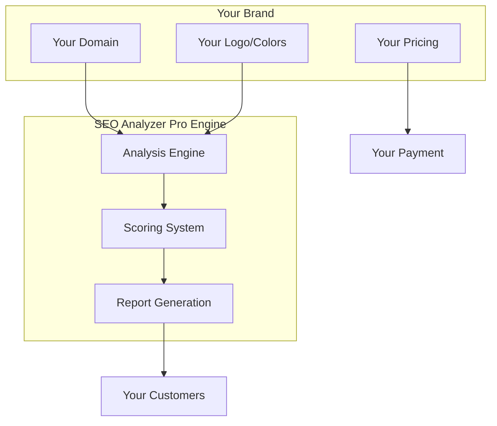
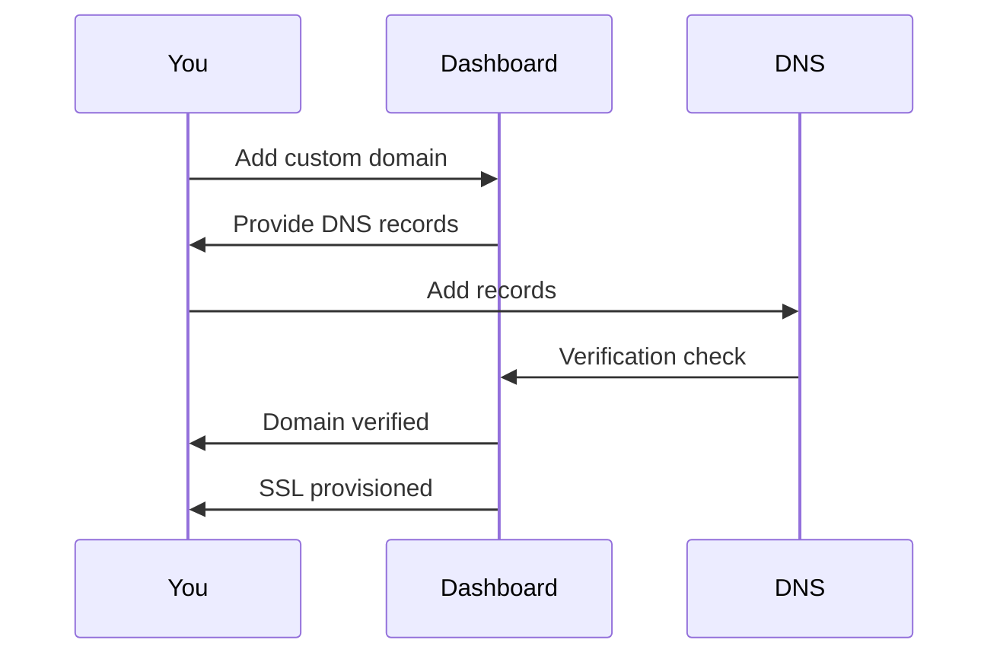
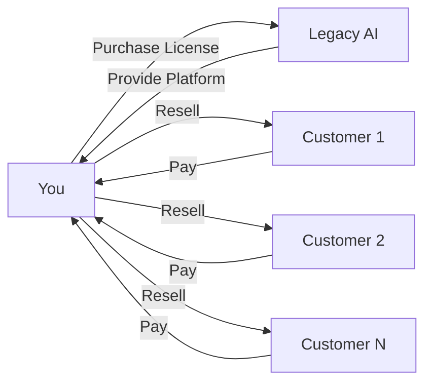

# SEO Analyzer Pro - White Label Guide

> Complete guide for white-labeling and reselling SEO Analyzer Pro

---

## Table of Contents

1. [Overview](#overview)
2. [Branding Customization](#branding-customization)
3. [Custom Domain Setup](#custom-domain-setup)
4. [Email Templates](#email-templates)
5. [Reseller Program](#reseller-program)
6. [License Management](#license-management)

---

## Overview

### What is White Labeling?

White labeling allows you to rebrand SEO Analyzer Pro as your own product. You can:

- Replace all branding with your company name and logo
- Use your own domain
- Customize colors and styling
- Set your own pricing
- Manage your own customers

### White Label Architecture



### License Tiers

| Tier | Price/month | Features |
|------|-------------|----------|
| **Starter** | $99 | 1,000 analyses, basic branding |
| **Professional** | $299 | 10,000 analyses, full branding, API access |
| **Enterprise** | $999 | Unlimited analyses, white-glove setup, priority support |

---

## Branding Customization

### Configuration File

Create a `branding.json` file in your project root:

```json
{
  "company": {
    "name": "Your Company Name",
    "tagline": "Your Tagline Here",
    "website": "https://yourcompany.com",
    "email": "support@yourcompany.com"
  },
  "branding": {
    "logo": {
      "light": "/assets/logo-light.svg",
      "dark": "/assets/logo-dark.svg",
      "favicon": "/assets/favicon.ico"
    },
    "colors": {
      "primary": "#3B82F6",
      "secondary": "#8B5CF6",
      "accent": "#10B981",
      "background": "#FFFFFF",
      "text": "#1F2937"
    },
    "fonts": {
      "heading": "Inter",
      "body": "Inter"
    }
  },
  "features": {
    "showPoweredBy": false,
    "customDomain": true,
    "whiteLabelReports": true
  }
}
```

### Logo Replacement

Replace the default logos in `/assets/`:

| File | Size | Format | Usage |
|------|------|--------|-------|
| `logo-light.svg` | 200x50 | SVG | Header (light mode) |
| `logo-dark.svg` | 200x50 | SVG | Header (dark mode) |
| `favicon.ico` | 32x32 | ICO | Browser tab |
| `logo-report.png` | 300x75 | PNG | PDF reports |

### Color Customization

Update the Tailwind configuration:

```javascript
// tailwind.config.js
module.exports = {
  theme: {
    extend: {
      colors: {
        primary: {
          50: '#EEF2FF',
          100: '#E0E7FF',
          500: '#3B82F6',  // Your primary color
          600: '#2563EB',
          700: '#1D4ED8',
        },
        secondary: {
          500: '#8B5CF6',  // Your secondary color
        }
      }
    }
  }
}
```

### CSS Variables

For runtime customization:

```css
:root {
  --color-primary: #3B82F6;
  --color-secondary: #8B5CF6;
  --color-accent: #10B981;
  --color-background: #FFFFFF;
  --color-text: #1F2937;
  --font-heading: 'Inter', sans-serif;
  --font-body: 'Inter', sans-serif;
}
```

### Header Customization

```html
<!-- Replace in index.html -->
<header class="bg-gradient-to-r from-primary-600 to-secondary-600">
    <div class="max-w-6xl mx-auto px-4">
        
        <h1 class="text-2xl font-bold">Your Product Name</h1>
        <p class="text-primary-100">Your tagline here</p>
    </div>
</header>
```

---

## Custom Domain Setup

### DNS Configuration

Add these DNS records for your custom domain:

| Type | Name | Value |
|------|------|-------|
| CNAME | www | your-subdomain.seoanalyzer.pro |
| CNAME | @ | your-subdomain.seoanalyzer.pro |
| TXT | _verification | your-verification-token |

### SSL Certificate

SSL is automatically provisioned for custom domains. Allow 24-48 hours for propagation.

### Domain Verification

1. Add domain in your dashboard
2. Add verification TXT record
3. Wait for verification (usually 1-24 hours)
4. Domain is activated



### Multi-Domain Setup

For multiple brands or regions:

```json
{
  "domains": [
    {
      "domain": "seo.yourcompany.com",
      "brand": "YourCompany SEO",
      "region": "US"
    },
    {
      "domain": "seo.yourcompany.eu",
      "brand": "YourCompany SEO Europe",
      "region": "EU"
    }
  ]
}
```

---

## Email Templates

### Transactional Emails

Customize email templates in `/templates/emails/`:

#### Welcome Email

```html
<!-- templates/emails/welcome.html -->
<!DOCTYPE html>
<html>
<head>
    <style>
        body { font-family: var(--font-body); }
        .header { background: var(--color-primary); color: white; }
        .button { background: var(--color-primary); }
    </style>
</head>
<body>
    <div class="header">
        
    </div>
    
    <h1>Welcome to {{product.name}}!</h1>
    
    <p>Hi {{user.name}},</p>
    
    <p>Thanks for joining {{company.name}}. You're ready to start 
    analyzing websites for SEO and GEO optimization.</p>
    
    <a href="{{dashboard.url}}" class="button">Get Started</a>
    
    <p>Best regards,<br>{{company.name}} Team</p>
</body>
</html>
```

#### Analysis Complete Email

```html
<!-- templates/emails/analysis-complete.html -->
<h1>Your Analysis is Ready</h1>

<p>The analysis for {{analysis.url}} is complete.</p>

<div class="score-card">
    <h2>Overall Score: {{analysis.score}}/100</h2>
    <ul>
        <li>On-Page SEO: {{analysis.onpage}}/100</li>
        <li>GEO Score: {{analysis.geo}}/100</li>
        <li>E-E-A-T: {{analysis.eeat}}/100</li>
    </ul>
</div>

<a href="{{analysis.url}}">View Full Report</a>
```

### Email Configuration

```bash
# .env
SMTP_HOST=smtp.yourcompany.com
SMTP_PORT=587
SMTP_USER=noreply@yourcompany.com
SMTP_PASS=your-password
EMAIL_FROM="Your Company <noreply@yourcompany.com>"
```

### Email Variables

| Variable | Description |
|----------|-------------|
| `{{company.name}}` | Your company name |
| `{{company.logo}}` | URL to your logo |
| `{{product.name}}` | Your product name |
| `{{user.name}}` | Recipient's name |
| `{{user.email}}` | Recipient's email |
| `{{dashboard.url}}` | Link to dashboard |
| `{{analysis.url}}` | Analyzed URL |
| `{{analysis.score}}` | Overall score |

---

## Reseller Program

### How It Works



### Reseller Benefits

| Benefit | Description |
|---------|-------------|
| **Margin** | 40-60% profit margin |
| **Support** | Priority technical support |
| **Training** | Sales and technical training |
| **Marketing** | Co-marketing opportunities |
| **Exclusivity** | Territory protection available |

### Pricing Flexibility

Set your own pricing:

```json
{
  "pricing": {
    "monthly": {
      "basic": 29,
      "pro": 79,
      "enterprise": 199
    },
    "annual": {
      "basic": 290,
      "pro": 790,
      "enterprise": 1990
    },
    "credits": {
      "100": 19,
      "500": 79,
      "1000": 149
    }
  }
}
```

### Customer Management

#### Dashboard Access

Your customers get their own dashboard at your domain:

```
https://seo.yourcompany.com/dashboard
```

#### User Roles

| Role | Permissions |
|------|-------------|
| **Admin** | Full access, billing, user management |
| **Manager** | Team management, all analyses |
| **Analyst** | Run analyses, view reports |
| **Viewer** | View reports only |

#### Customer API

Your customers can use your branded API:

```bash
curl https://api.yourcompany.com/v1/analyze \
  -H "Authorization: Bearer YOUR_CUSTOMER_KEY" \
  -d '{"url": "https://example.com"}'
```

---

## License Management

### License Types

| Type | Description | Use Case |
|------|-------------|----------|
| **SaaS** | Hosted by us | Quick start, no maintenance |
| **Self-Hosted** | Host on your servers | Full control, data privacy |
| **Hybrid** | API only, your frontend | Custom UI, our engine |

### License Keys

Each license includes:

```
LICENSE-XXXX-XXXX-XXXX-XXXX
├── Type: PROFESSIONAL
├── Domains: 5
├── Analyses: 10,000/month
├── API Access: Yes
├── White Label: Yes
└── Support: Priority
```

### License Validation

```javascript
// Validate license on startup
import { validateLicense } from '@seoanalyzer/license';

const license = await validateLicense(process.env.LICENSE_KEY);

if (!license.valid) {
  console.error('Invalid license:', license.error);
  process.exit(1);
}

console.log('License valid:', {
  type: license.type,
  expires: license.expiresAt,
  features: license.features
});
```

### License Dashboard

Access your license dashboard at:

```
https://licenses.seoanalyzer.pro
```

Features:
- View all licenses
- Monitor usage
- Renew/upgrade licenses
- Generate customer API keys
- View billing history

### Usage Tracking

```javascript
// Track usage
import { trackUsage } from '@seoanalyzer/analytics';

await trackUsage({
  licenseKey: process.env.LICENSE_KEY,
  action: 'analysis',
  metadata: {
    url: 'https://example.com',
    score: 75
  }
});
```

### Billing

| Billing Cycle | Discount |
|---------------|----------|
| Monthly | None |
| Quarterly | 5% |
| Annual | 15% |
| Biennial | 25% |

---

## Getting Started

### Step 1: Sign Up

1. Visit [seoanalyzer.pro/reseller](https://seoanalyzer.pro/reseller)
2. Complete the reseller application
3. Wait for approval (1-2 business days)

### Step 2: Choose Plan

Select your white-label tier:

| Plan | Setup Fee | Monthly | Best For |
|------|-----------|---------|----------|
| Starter | $0 | $99 | Agencies starting out |
| Professional | $499 | $299 | Growing agencies |
| Enterprise | $999 | $999 | Large organizations |

### Step 3: Configure Branding

1. Upload your logo
2. Set your colors
3. Configure your domain
4. Customize email templates

### Step 4: Launch

1. Test your branded instance
2. Set up billing (Stripe integration)
3. Launch to your customers

---

## Support

### Reseller Support Channels

| Channel | Response Time |
|---------|---------------|
| Email | 24 hours |
| Chat | 4 hours |
| Phone | 1 hour (Enterprise) |

### Resources

- **Documentation**: [docs.seoanalyzer.pro](https://docs.seoanalyzer.pro)
- **Partner Portal**: [partners.seoanalyzer.pro](https://partners.seoanalyzer.pro)
- **Community**: [community.seoanalyzer.pro](https://community.seoanalyzer.pro)

### Training

| Training Type | Duration | Included With |
|---------------|----------|---------------|
| Platform Overview | 1 hour | All plans |
| Technical Deep Dive | 2 hours | Professional+ |
| Sales Training | 2 hours | Enterprise |
| Custom Training | Varies | Enterprise |

---

## FAQ

### Can I use my own payment processor?

Yes, Enterprise plans can integrate custom payment processors.

### Is there a minimum commitment?

Starter plans are month-to-month. Professional and Enterprise have annual commitments.

### Can I migrate existing customers?

Yes, we provide migration tools and support.

### What happens if I exceed my analysis limit?

Additional analyses are billed at overage rates, or you can upgrade your plan.

### Can I offer a free tier to my customers?

Yes, you control pricing and can offer free tiers.

---

<div align="center">

**Become a Reseller**: reseller@legacyai.space

Copyright (c) 2026 Legacy AI / Floyd's Labs

www.LegacyAI.space | www.FloydsLabs.com

</div>
